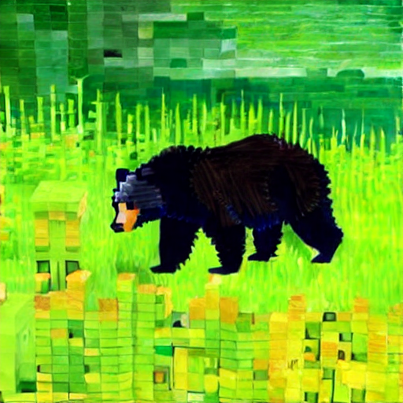

# Seamless Dual-Style Image Generation with Diffusion Models

Project by Adrien Goldszal & Gabriel Mercier for the *Computer Vision : From Fundamentals to Applications* class of Ecole Polytechnique. 

One little explored frontier of image generation is blending two different styles seamlessly within a single output. We present two methods based on latent diffusion models that outperform simple text-based prompting: noise spatial interpolation and attention weight interpolation between two style prompts.

| **Original image** | **Epsilon** | **Cross-Attention** |
|:-------------------:|:-----------:|:-------------------:|
|  |  |  |
|  |  |  |
|  |  |  |

**Comparison of style fusion results using Epsilon Interpolation and Cross-Attention Interpolation.**


**Remark**: This project uses **CycleDiffusion** [**[Paper link]**](https://arxiv.org/abs/2210.05559) [**[Repository link]**](https://github.com/ChenWu98/cycle-diffusion?tab=readme-ov-file) as a backbone, a style-transfer and image editing model based on stable-diffusion. 

## Repository Structure

A faire

## Installation Instructions

1. Create an environment by running

```shell
conda env create -f environment.yml
conda activate generative_prompt
pip install git+https://github.com/openai/CLIP.git
```

2. Install `torch` and `torchvision` based on your CUDA version.
3. Install [taming-transformers](https://github.com/CompVis/taming-transformers) by running

```shell
cd ../
git clone git@github.com:CompVis/taming-transformers.git
cd taming-transformers/
pip install -e .
cd ../
```
4. Install Stable Diffusion

```shell
cd ckpts/
mkdir stable_diffusion
cd stable_diffusion/
# Download pre-trained checkpoints for Stable Diffusion here.
# You should download this version: https://huggingface.co/CompVis/stable-diffusion-v-1-4-original
# Due to licence issues, we cannot share the pre-trained checkpoints directly.
```

## Running the code